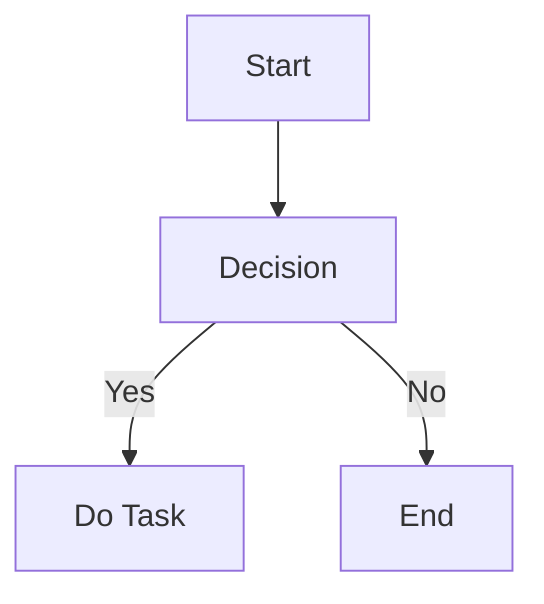
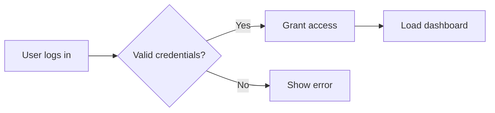
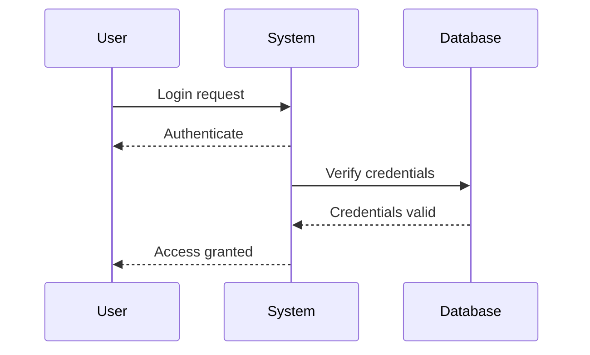
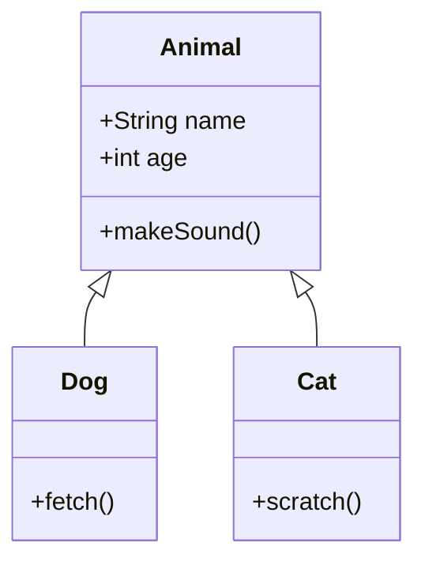
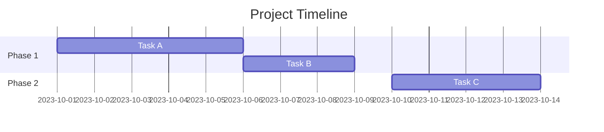
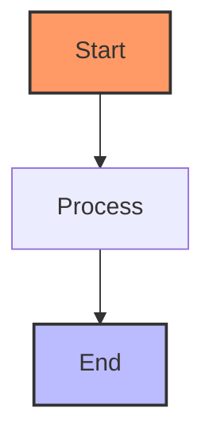
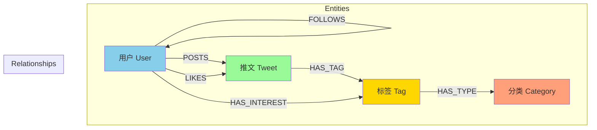

## 搭建

[使用Jekyll + GitHub Pages搭建个人博客](https://zzy979.github.io/posts/creating-personal-blog-site/)

### 安装

[ruby](https://rubyinstaller.org/downloads/)

将`MSYS2`目录添加到环境变量中

```bash
ridk
ridk enable
```

检查

```bash
ruby -v
gem -v
```

安装`jekyll`

``` bash
gem install jekyll bundler
jekyll -v
```

安装依赖的theme模板库，在项目目录运行 `bundle`

使用:

构建 `jekyll build` 或 `jekyll b`

本地部署 `jekyll serve` 或 `jekyll s`

## 写作

[Writing a New Post](https://chirpy.cotes.page/posts/write-a-new-post/)

[Text and Typography](https://chirpy.cotes.page/posts/text-and-typography/)

## blockquote

> 一个领域专家的标准：犯过这个领域内几乎所有的错误。
{: .prompt-tip }

> For we walk by faith, not by sight.
{: .prompt-info }

> 己所不欲，勿施于人。
{: .prompt-warning }

> 很多东西更重要，不要浪费在根本**不存在**的东西上。欺骗、狂妄、病态的利己主义、满腹怨恨、极端自怜、受害妄想症，这些都阻止成功。你们要找到所有这些阻碍成功的东西，将它们当作瘟疫，绕道而走。 -- 查理芒格 2017
{: .prompt-danger }

> God grant me the serenity to accept the things I can not change,\
请赐我平静的心，去接受我无法改变的事；\
courage to change the things I can,\
赐我勇气，去改变我能够改变的事；\
And the wisdom to know the difference.\
并赐我智慧，去分辨这两者的不同。

## 代码

```bash
echo lambda
```

```
delta
```

## 公式

$$
\lambda \delta
$$

$$
\Lambda \Delta
$$

## mermaid

### demo



### Flowchart



### Sequence Diagram



### Class Diagram



### Gantt Chart  



### Customizing Appearance 



### schema




