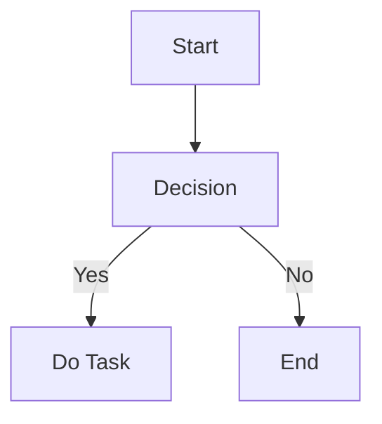
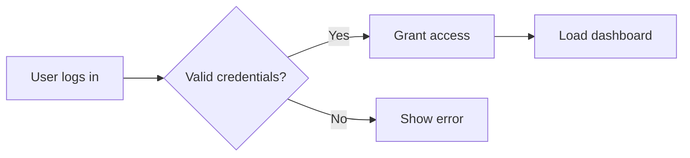
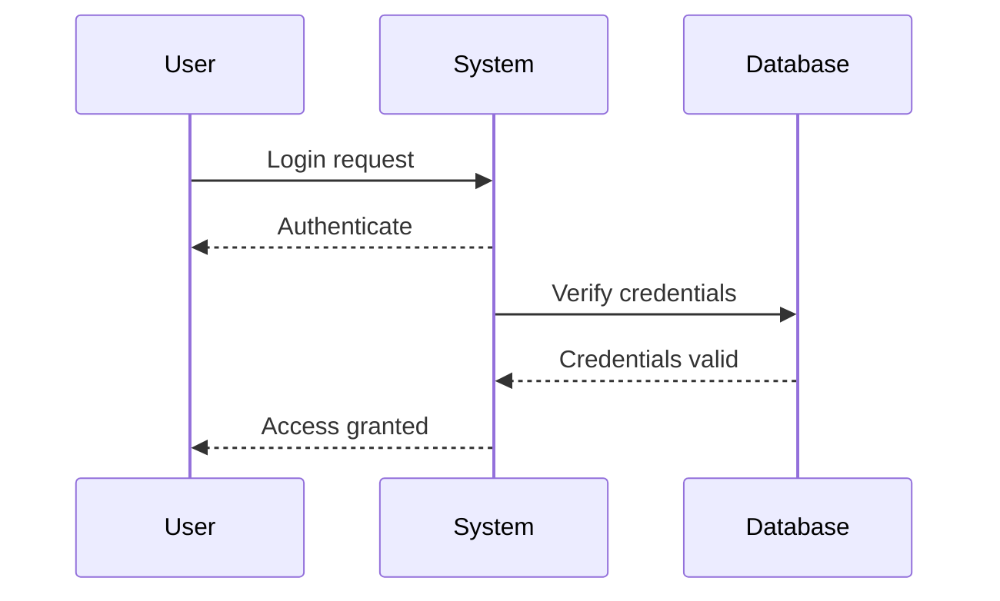
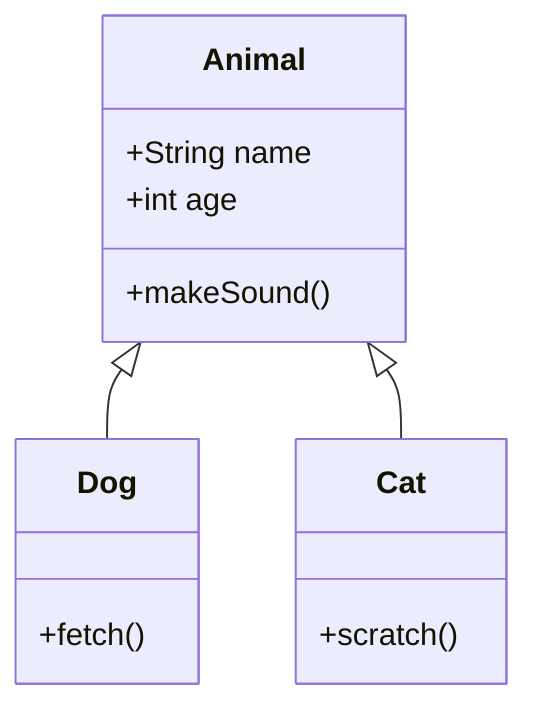
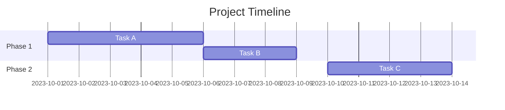
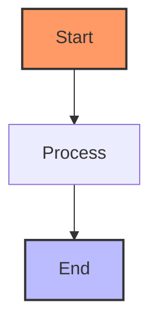
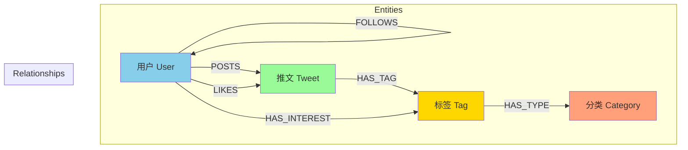

## 搭建

[使用Jekyll + GitHub Pages搭建个人博客](https://zzy979.github.io/posts/creating-personal-blog-site/)

### 安装

[ruby](https://rubyinstaller.org/downloads/)

将`MSYS2`目录添加到环境变量中

```bash
ridk
ridk enable
```

检查

```bash
ruby -v
gem -v
```

安装`jekyll`

``` bash
gem install jekyll bundler
jekyll -v
```

安装依赖的theme模板库，在项目目录运行 `bundle`

使用:

构建 `jekyll build` 或 `jekyll b`

本地部署 `jekyll serve` 或 `jekyll s`

## 写作

[Writing a New Post](https://chirpy.cotes.page/posts/write-a-new-post/)

[Text and Typography](https://chirpy.cotes.page/posts/text-and-typography/)

## blockquote

> 一个领域专家的标准：犯过这个领域内几乎所有的错误。
{: .prompt-tip }

> For we walk by faith, not by sight.
{: .prompt-info }

> 己所不欲，勿施于人。
{: .prompt-warning }

> 很多东西更重要，不要浪费在根本**不存在**的东西上。欺骗、狂妄、病态的利己主义、满腹怨恨、极端自怜、受害妄想症，这些都阻止成功。你们要找到所有这些阻碍成功的东西，将它们当作瘟疫，绕道而走。 -- 查理芒格 2017
{: .prompt-danger }

### Serenity Prayer

> God grant me the serenity to accept the things I can not change,\
请赐我平静的心，去接受我无法改变的事；\
courage to change the things I can,\
赐我勇气，去改变我能够改变的事；\
And the wisdom to know the difference.\
并赐我智慧，去分辨这两者的不同。

### If—
**By Rudyard Kipling**  
拉迪亚德·吉卜林

> **If you can keep your head when all about you  
> Are losing theirs and blaming it on you,  
> If you can trust yourself when all men doubt you,  
> But make allowance for their doubting too;**  

> 如果在众人六神无主、乱作一团之时，  
> 你能镇定自若，不为所动；  
> 如果在众人对你心存疑虑之际，  
> 你仍能相信自己，同时也体谅他们的怀疑；  

> **If you can wait and not be tired by waiting,  
> Or being lied about, don’t deal in lies,  
> Or being hated, don’t give way to hating,  
> And yet don’t look too good, nor talk too wise:**  

> 如果你能等待，且不因等待而疲倦，  
> 即使遭人诽谤，也不以谎言回击，  
> 即使被人憎恨，也不心怀怨恨，  
> 同时还能做到不显得圣洁无瑕，也不故作高深；  

> **If you can dream—and not make dreams your master;  
> If you can think—and not make thoughts your aim;  
> If you can meet with Triumph and Disaster  
> And treat those two impostors just the same;**  

> 如果你有梦想，却不做梦想的奴隶；  
> 如果你善思考，却不以思想为唯一目标；  
> 如果你能坦然面对胜利与灾难，  
> 并把这两个骗子同样看待；  

> **If you can bear to hear the truth you’ve spoken  
> Twisted by knaves to make a trap for fools,  
> Or watch the things you gave your life to, broken,  
> And stoop and build ’em up with worn-out tools:**  

> 如果你能忍受自己说出的真理，  
> 被恶人扭曲成愚人的陷阱；  
> 或者眼看你倾注心血的事业毁于一旦，  
> 却仍肯俯身，用磨损的旧工具重新建造；  

> **If you can make one heap of all your winnings  
> And risk it on one turn of pitch-and-toss,  
> And lose, and start again at your beginnings  
> And never breathe a word about your loss;**  

> 如果你能把毕生所得孤注一掷，  
> 投入一次风险莫测的赌局，  
> 然后一朝输尽，又能从头开始，  
> 且绝口不提自己的失败；  

> **If you can force your heart and nerve and sinew  
> To serve your turn long after they are gone,  
> And so hold on when there is nothing in you  
> Except the Will which says to them: “Hold on!”**  

> 如果你能在身心俱疲、精疲力竭之后，  
> 仍能驱使你的心、你的神经、你的筋骨继续前行；  
> 如果在你一无所有、空荡如也之时，  
> 仍有一个意志在低语：“坚持下去！”  

> **If you can talk with crowds and keep your virtue,  
> Or walk with Kings—nor lose the common touch,  
> If neither foes nor loving friends can hurt you,  
> If all men count with you, but none too much;**  

> 如果你能与人群交谈而不失本心，  
> 或与君王同行而不失平民本色；  
> 如果无论是敌人还是挚友都无法伤害你，  
> 如果你珍视每个人，却不过分倚重任何一人；  

> **If you can fill the unforgiving minute  
> With sixty seconds’ worth of distance run,  
> Yours is the Earth and everything that’s in it,  
> And—which is more—you’ll be a Man, my son!**  

> 如果你能将那无情流逝的每一分钟，  
> 都填满六十秒的价值与奔跑；  
> 那么，整个世界都将属于你，  
> 而——更重要的是——你将真正成为一个人，我的孩子！


## 代码

```bash
echo lambda
```

```
delta
```

## 公式

$$
\lambda \delta
$$

$$
\Lambda \Delta
$$

## mermaid

### demo



### Flowchart



### Sequence Diagram



### Class Diagram



### Gantt Chart  



### Customizing Appearance 



### schema




